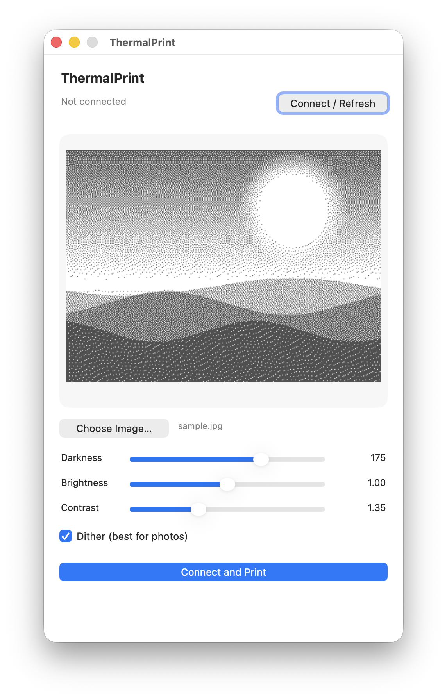

# ThermalPrint

Print photos to a cheap **MXW01** Bluetooth thermal printer (the ones that advertise
as `MXW01-XXXX`) from macOS — without the adware "Fun Print" iOS app.

ThermalPrint scales any photo to the printer's 384 px width, Floyd–Steinberg dithers it
to 1-bit black & white so gradients still read well, and streams it over Bluetooth LE.
It ships as a drag-and-drop Mac app and as a command-line tool, both built on a
clean-room implementation of the documented MXW01 protocol — no vendored third-party code.

<p align="center">
  
</p>

## What's in the box

- **`ThermalPrint.app`** — a drag-and-drop Mac app. Drop a photo on it (or double-click
  to pick one) and it prints. Grab a prebuilt copy from the Releases page (below) or
  build it yourself with `app/build_release.sh`.
- **`mxprint.py`** — the same thing as a command-line tool, with more options.
- **`mxw01.py`** — the core library: BLE protocol + image dithering.
- **`gui.py`** — the native macOS (Cocoa / PyObjC) interface the app launches.

The printer is 384 px wide, 1-bit black/white. Photos are auto-scaled to width and
Floyd–Steinberg dithered so gradients look decent in pure black & white.

## Download & install

Grab `ThermalPrint-<version>.zip` from the Releases page:

https://github.com/xwrvnggp9n-star/ThermalPrint/releases

1. Unzip it (double-click the zip).
2. Drag **ThermalPrint.app** into **/Applications**.
3. **First launch only:** right-click (or Control-click) the app and choose
   **Open**, then click **Open** in the dialog. The app is ad-hoc signed (no paid
   Apple developer certificate), so macOS blocks a plain double-click the first
   time. After that, it opens normally.

The prebuilt app is self-contained (Python and all libraries are bundled) and built
for Apple silicon (arm64). On an Intel Mac, build from source instead (see
"Building a release" below).

## Auto-update

The app keeps itself current from GitHub Releases:

- At launch it silently checks for a new version, at most once a day. If one is
  found, it offers **Install Update**, **Skip This Version**, or **Later**.
- **ThermalPrint → Check for Updates…** checks on demand.
- **Skip This Version** mutes the launch prompt for that version only; the next
  release prompts again.

Installing an update downloads the zip, swaps the app bundle in place, and relaunches.

## Using the app

1. **Turn the printer on.**
2. Drop an image onto **ThermalPrint.app** (or double-click it and choose images).
3. **The first time**, macOS asks to allow Bluetooth — click **Allow**. (This is why
   it's a real `.app` and not just a script: only a signed app bundle with a Bluetooth
   usage description can get this permission.)
4. It scans, connects, and prints. The printer address is cached, so it's instant
   after the first run.

### Menu bar & keyboard shortcuts

| Shortcut | Action |
|----------|--------|
| ⌘O | Open… (choose images) |
| ⌘P | Print |
| ⌘W | Close window |
| ⌘Q | Quit |
| ⌘? | ThermalPrint Help |

The **ThermalPrint** menu also has **About ThermalPrint** and **Check for
Updates…**; the **Help** menu links to this repo on GitHub.

## Setup for development (one time)

```bash
cd ~/Projects/ThermalPrint
python3 -m venv .venv
.venv/bin/python -m pip install bleak Pillow
.venv/bin/python gui.py          # run the GUI directly, no bundle needed
```

Two build scripts live in `app/`:

- **`app/build_app.sh`** — the thin dev build: a small `.app` whose launcher runs
  `gui.py` out of this checkout's venv. Quick to build, but tied to this machine
  (absolute paths baked in) — not distributable.
- **`app/build_release.sh`** — the real, self-contained build (see below).

## Building a release

```bash
bash app/build_release.sh
```

This bundles Python and all dependencies with PyInstaller, ad-hoc signs the app,
and produces:

- `dist/ThermalPrint.app` — self-contained, drag anywhere
- `dist/ThermalPrint-<version>.zip` — the distributable

Requires an Apple silicon Mac (the bundle is arm64; PyInstaller builds for the
host architecture). The version comes from `version.py`.

To publish to GitHub Releases (needs the `gh` CLI, authenticated as the repo owner):

```bash
bash app/publish_release.sh
```

It builds (unless `--skip-build`), tags `v<version>`, and uploads the zip. Bump
`__version__` in `version.py` first if the release already exists.

## Using the CLI

```bash
.venv/bin/python mxprint.py scan                 # find the printer, cache its address
.venv/bin/python mxprint.py status               # battery / paper / temperature
.venv/bin/python mxprint.py photo.jpg            # print a photo
.venv/bin/python mxprint.py a.jpg b.jpg c.jpg    # print several
.venv/bin/python mxprint.py preview photo.jpg    # save the dithered bitmap, don't print
```

Options:

| Flag | Meaning |
|------|---------|
| `-i, --intensity N` | Darkness 0–255 (default 175). Lower it if prints smear; raise toward 255 if faint. |
| `--no-dither` | Hard black/white threshold instead of dithering (good for line art / text). |
| `--rotate` | Rotate 180°. |
| `--invert` | Swap black/white. |
| `--feed N` | Blank lines fed after each image (default 40) so you can tear it off. |
| `-d, --device ADDR` | Use a specific BLE address instead of auto-discovering. |

## Troubleshooting

**"Print failed" / it aborts immediately** — almost always Bluetooth permission.
- Make sure you granted the Bluetooth prompt. Check **System Settings → Privacy &
  Security → Bluetooth** and confirm **ThermalPrint** is listed and enabled.
- If it never prompted, run the CLI once from **Terminal** (`.venv/bin/python
  mxprint.py scan`) and grant Terminal Bluetooth access when asked; that also unblocks
  the app.

**"App is damaged" / won't open after download** — that's Gatekeeper objecting to the
ad-hoc signature. Right-click the app and choose **Open** (see "Download & install").

**"No MXW01 printer found"** — printer off, asleep, or already connected to your phone.
Power-cycle it and make sure the Fun Print app / phone isn't holding the connection.

**Prints are too light or too dark** — adjust `--intensity` (try 60–120).

**"No paper" / nothing comes out** — check the roll; the status command reports paper
and battery state.

## How it works (protocol)

BLE service `0000ae30-…`; commands on characteristic `AE01`, notifications on `AE02`,
image data on `AE03`. Each command is `22 21 <cmd> 00 <len_le> <payload> <crc8> FF`
(CRC-8/SMBUS over the payload). Print flow: query status → set intensity → send print
request with line count → stream 48-bytes-per-line 1bpp data → flush → await
print-complete. See `mxw01.py` for the details.

## License

MIT. See [LICENSE](LICENSE).
